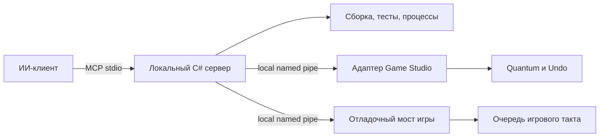

# Stride: MCP, диагностика и рабочий цикл Rat Expedition

Дата исследования: 2026-09-08. Основание: [ADR-018](../vault/production/decisions/ADR-018%20Rat%20expedition%20uses%20Stride.md), [GDD](../vault/game/GDD.md), [карточка исследования](../vault/production/tasks/research-open-engine-foundation.md).

**Stride выбран пользователем.** Предлагается проверить AkerMCP для работы с Game Studio, добавить собственный узкий мост в отладочную игру и объединить сборку, тесты и запуск через MCP. Это проект архитектуры: исходники и документация изучены, но MCP не установлен и runtime-совместимость не проверена. Найденные локально SDK .NET 6.0.428 и 10.0.300 не доказывают наличие подходящей установки Stride.

## Что уже доступно

Есть сторонний проект [AkerMCP](https://github.com/lorenzo-cambiaghi/AkerMCP/tree/687d9e91c696b2157060bb95715ab92e2b098ffc) с адаптером Stride. Исследован commit `687d9e91c696b2157060bb95715ab92e2b098ffc`; лицензия — [Apache-2.0](https://github.com/lorenzo-cambiaghi/AkerMCP/blob/687d9e91c696b2157060bb95715ab92e2b098ffc/LICENSE). Это кандидат на переиспользование, а не подтверждённая готовая интеграция нашего проекта.

| Область | Что подтверждено исходниками | Практическое ограничение |
|---|---|---|
| Подключение | [Проект адаптера](https://github.com/lorenzo-cambiaghi/AkerMCP/blob/687d9e91c696b2157060bb95715ab92e2b098ffc/plugins/stride/AkerMcp.Stride.csproj) использует `net10.0-windows` и локальные сборки Game Studio через `StrideBin` | Нужно закрепить и совместно проверить версии редактора, .NET и адаптера |
| Загрузка | [Wrapper](https://github.com/lorenzo-cambiaghi/AkerMCP/blob/687d9e91c696b2157060bb95715ab92e2b098ffc/install-stride-wrapper.ps1) настраивает запуск с `DOTNET_STARTUP_HOOKS` для Game Studio | Это способ внедрения AkerMCP, не официальный механизм обнаружения сторонних плагинов Stride; дочерние процессы редактора могут наследовать переменную |
| Редактирование | [SceneBridge](https://github.com/lorenzo-cambiaghi/AkerMCP/blob/687d9e91c696b2157060bb95715ab92e2b098ffc/plugins/stride/StrideSceneBridge.cs) пишет через Quantum и Undo; использует reflection внутренних типов | Для свойства поддержан один уровень вложенной структуры; выбор первого открытого hierarchy editor требует проверки адресации активной сцены |
| Потоки | [Dispatcher](https://github.com/lorenzo-cambiaghi/AkerMCP/blob/687d9e91c696b2157060bb95715ab92e2b098ffc/plugins/stride/StrideMainThreadDispatcher.cs) переносит работу на WPF Dispatcher | Это поток редактора; команды самостоятельной игры требуют её собственного игрового потока |
| Play mode | [PlayModeController](https://github.com/lorenzo-cambiaghi/AkerMCP/blob/687d9e91c696b2157060bb95715ab92e2b098ffc/plugins/stride/StridePlayModeController.cs) явно возвращает `Supported=false` для enter/exit/pause/step | Управление прохождением игры придётся реализовать отдельно |
| Изображение | [ScreenCapture](https://github.com/lorenzo-cambiaghi/AkerMCP/blob/687d9e91c696b2157060bb95715ab92e2b098ffc/plugins/stride/StrideScreenCapture.cs) ставит чтение backbuffer в задачу editor game и ждёт до 3000 мс | При простое возможен `null` и переход на захват окна ОС; это не гарантированный чистый игровой кадр |

## Предлагаемая архитектура

Официальный [C# SDK MCP](https://github.com/modelcontextprotocol/csharp-sdk/blob/main/docs/concepts/getting-started.md) документирует создание сервера со stdio transport и регистрацией tools. Версию пакета закрепить при проверочном срезе. MCP описывает команды и результаты, а способ управления Stride остаётся ответственностью адаптера.

Начать с оценки закреплённого AkerMCP как редакторного адаптера. Наш слой должен иметь узкий контракт и позволять заменить адаптер, если его привязка к внутренностям Game Studio окажется ненадёжной. Не строить параллельно полный редакторный мост с нуля.

Каждый запрос адресовать явным `projectId`, `processId`, `sessionId` и, для редактора, `sceneId`; несколько открытых проектов не должны приводить к изменению первого найденного. Локальная named pipe доступна текущему пользователю и проверяет идентификатор сессии. Для изменений передавать ожидаемую revision, возвращать конфликт при устаревшем состоянии. Использовать типизированные разрешённые команды; произвольный `execute` не включать в штатный набор.

Изменения сцены проходят через Quantum/Undo и явное сохранение. Runtime-мост принимает семантический ввод (`move`, `crouch`, `interact`), ставит его в очередь игрового такта и возвращает снимок после выполнения. Снимок содержит tick, revision, позицию, стойку, опору, доступное действие и причину отказа. Пауза и пошаговый режим — наши будущие команды, их наличие у AkerMCP не предполагается. Мост исключается из распространяемой Release-игры.

| Предлагаемый инструмент | Результат и владелец |
|---|---|
| `status` | Версии, проект/сессия, capabilities адаптеров |
| `build`, `test` | `jobId`, затем статус, exit code, журнал и пути артефактов; orchestration |
| `launch`, `stop` | Отдельный игровой процесс и sessionId; orchestration |
| `scene_inspect`, `scene_change` | Сцена, свойства, revision, транзакция Undo; редактор |
| `snapshot` | Согласованный JSON со временем игрового такта; игра |
| `run_scenario` | Семантические действия, проверки, причины отказа; игра |
| `capture_frame` | Игровой кадр, tick/сессия и режим захвата; игра |

Долгие build/test выполняются заданиями с отменой и таймаутом. В изученном [BuildManager](https://github.com/lorenzo-cambiaghi/AkerMCP/blob/687d9e91c696b2157060bb95715ab92e2b098ffc/plugins/stride/StrideBuildManager.cs) stdout и stderr читаются последовательно до ожидания с таймаутом: статически виден риск зависания, на практике не воспроизведён. Наш runner должен читать оба потока одновременно, ограничивать весь процесс и брать путь артефакта из фактического build/publish. При запуске build/runtime очищать унаследованный startup hook. Ошибка сборки не запускает старую программу молча. Скриншот окна редактора и кадр игры имеют разные типы артефактов; fallback явно указан.

## Остальные инструменты игры

Stride документирует world-space спрайты, `Billboard`, `Ignore depth`, `Point` sampler и `Alpha cutoff`. Это подходящая исходная точка для 2D-персонажей в 3D, но пиксельную стабильность, прозрачные края и перекрытия под мостом нужно проверить на нашей ортографической сцене. [Документация спрайтов](https://doc.stride3d.net/latest/en/manual/sprites/use-sprites.html).

[Stride Community Toolkit](https://stride3d.github.io/stride-community-toolkit/) предлагает Bepu, DebugShapes, ImGui и Windows helpers. Его сайт предупреждает о preview и возможных breaking changes, указывает .NET 10. Рассмотреть закреплённую версию для отладочной геометрии и панелей; полный набор зависимостей заранее не принимать.

Правила партии, квестов, диалогов и сохранений проектировать как наши C#-модули с версионированными данными. Toolkit и MCP не являются готовым RPG-набором. Чистые правила тестировать без GPU, а сцены, физику, импорт, рендеринг и пакет — отдельными интеграционными сценариями. Официальный пример Stride unit tests использует игровой цикл и xUnit; пример с .NET 8 не подтверждает совместимость выбранной будущей версии. [Документация тестов Stride 4.2](https://doc.stride3d.net/4.2/en/manual/troubleshooting/unit-tests.html).

## Минимальная проверка перед переносом P1

1. Закрепить Stride, SDK .NET, MCP SDK и commit адаптера; записать воспроизводимую сборку и запуск Game Studio. Проверить отсутствие неоднозначного выбора при двух открытых сценах.
2. Создать ортографическую сцену со спрайтом, мостом, рампой и низким лазом. Через MCP прочитать объект, изменить свойство, отменить, сохранить и повторно открыть сцену; сравнить результат на диске.
3. Собрать самостоятельный Windows x64 пакет и запустить без checkout. Подключить отладочный мост к выбранному процессу, пройти рампу и лаз семантическими командами, получить снимок и игровой кадр с идентификатором такта.
4. Повторить сценарий после чистой сборки. Проверить отказ от устаревшей revision, неверной сессии, отсутствующего моста и ошибки сборки; подтвердить отсутствие моста в Release-пакете.

Результат среза — зафиксированные версии, capability matrix с фактическими pass/fail, журналы и изображения. Неизвестными пока остаются совместимость AkerMCP с выбранным Game Studio, устойчивость Undo/save и снимков, точная стоимость импорта и сборки. Выбор Stride уже принят; эта проверка определяет пригодный способ интеграции и объём адаптации P1.
