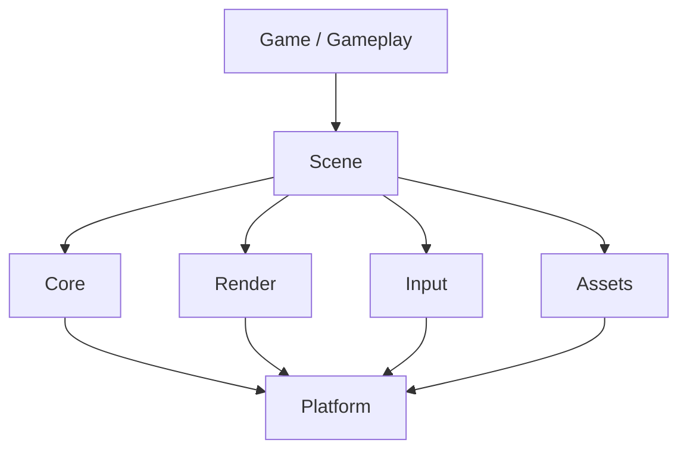

# Architecture

## Слои

## Границы ответственности

- **Core** — типы, время, math, logging, job/queue primitives.
- **Platform** — окно, файлы, время ОС, входные устройства.
- **Render** — draw calls, материалы, камера; без геймплейной логики.
- **Input** — raw → actions mapping.
- **Assets** — загрузка, кэш, hot-reload hooks.
- **Scene** — сущности/компоненты или эквивалент, жизненный цикл кадра.

## Правила зависимостей

- Gameplay не импортирует Platform напрямую.
- Render не знает о геймплейных типах.
- Циклические зависимости между слоями — запрещены; выносить в Core или событие.

Сверка игровых паттернов (цикл, ввод, звук, event VM) — [[Game Programming Patterns]].

## Open questions

- Entity model: ECS vs scene-graph vs hybrid? — [[research: Entity model ECS vs scene vs hybrid]]
- Scripting layer в MVP или позже?
