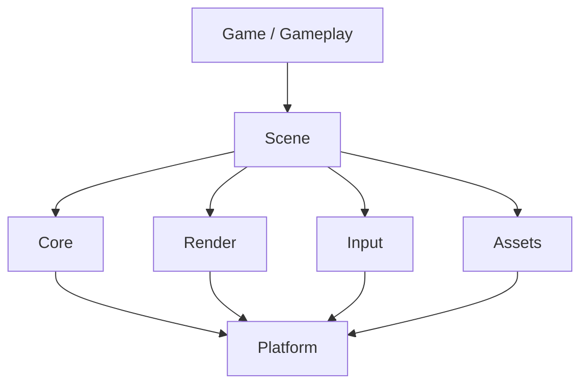

# Architecture

## Слои

## Границы ответственности

- **Core** — типы, время, math, logging, job/queue primitives.
- **Platform** — окно, файлы, время ОС, входные устройства.
- **Render** — draw calls, материалы, камера; без геймплейной логики.
- **Input** — raw → actions mapping.
- **Assets** — загрузка, кэш, hot-reload hooks.
- **Scene** — сущности/компоненты или эквивалент, жизненный цикл кадра.

## Правила зависимостей

- Gameplay не импортирует Platform напрямую.
- Render не знает о геймплейных типах.
- Циклические зависимости между слоями — запрещены; выносить в Core или событие.

Сверка игровых паттернов (цикл, ввод, звук, event VM) — [[Game Programming Patterns]].

Целевая нарезка библиотек и этапы — [architecture roadmap](../../docs/architecture-roadmap.md), очередь в [[Sprint 7 — Engine architecture]].

## Entity model

Закрыто [[ADR-012 Entity model EntityId and ComponentStore]]: гибрид `EntityId` + generation и `ComponentStore` для Transform / Renderable / Collider. Игрок, события и `SimulationSession` остаются POD до отдельной миграции. Не scene-graph identity и не archetype ECS. Критерии расширения — в ADR. Исследование: [[research-entity-model-ecs-vs-scene|research: Entity model ECS vs scene vs hybrid]].

## Open questions

- Scripting layer в MVP или позже?

## Actual compiled boundaries

CMake builds `rat_core`, `rat_engine`, `rat_editor_logic`, and `rat-editor`. Runtime,
authoring, asset descriptors and entity scaffolding still share `rat_core`.
`rat_engine` adds bgfx; `rat_editor_logic` remains headless; the executable owns GLFW,
ImGui and audio adapters. The layer diagram above describes intended separation,
not independent targets already available. See [current roadmap](../../docs/architecture-roadmap.md).
