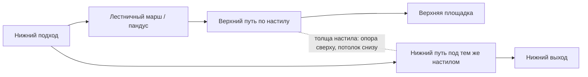

# Ярусные карты: мост, нижний путь и читаемость

Основание: два изображения пользователя от 2026-09-08 и прямое пожелание ходить по мостам и под ними. [[GDD]] определяет игру, [[rat-expedition-art-audio]] — визуальный разбор. Изображения находятся во вложениях разговора; локальный файл здесь не заявлен. Ракурс 3/4 уточняет подачу уже выбранного мира с 2D-персонажами в 3D.

## Пространство и маршруты

Одна точка на плане может иметь несколько пригодных для ходьбы высот. Настил имеет верх, толщину и нижнюю грань; под ним остаётся объём для героя. Опоры и перила занимают свои места, арочный декор не создаёт невидимого сплошного фундамента. Ступени/пандусы связывают высоты; приставная лестница — отдельный контекстный подъём. У каждой обязательной связи есть безопасные подход и выход.

Схема — разрез связей, пунктир не разрешает переход сквозь плиту. Точные высоты/размеры fixture — предложения A4 в [P1](../../../docs/rat-expedition-traversal-spec.md), а не количество этажей всей игры. Проход снизу и подъём сверху проверяются в обе стороны. Персонаж не перескакивает на ближайший этаж только из-за совпадения положения на плане.

Если настил/стена закрывает лидера, соответствующая группа архитектуры скрывается в изображении, открывая героя и участок его маршрута. Коллизии не исчезают; спутники следуют пройденной связью, не срезают через настил. Перила и видимые края помогают понять, на каком пути стоит группа. Взаимодействие сначала проверяет доступность по высоте и преградам, затем выбирает ближайшую цель: рычаг сверху не доступен снизу.

## Проверка по этапам

- P1: небольшой серый мост, маршрут под ним, подход наверх по пандусу/маршу, потолок и края; скрытие настила/стен и устойчивое следование. Проверяются также существующие контекстные лестницы/порталы на разных высотах.
- P2: два предмета в одной области плана, но на разных высотах; доступны только с соответствующего маршрута, без действия сквозь настил.
- E3: один оформленный фрагмент с модульной архитектурой, палитрой и деталями по двум ориентирам. Масштаб/пиксельная сетка проверяются до массового изготовления; размер города и сюжет собора не заимствуются автоматически.

Существующие [[feat-walkable-bridges-over-open-ground]] и [[feat-voxel-3d-terrain-and-rotating-ramps]] завершены: используем их геометрию/коллизии, не создаём заново систему мостов. Игровые перекрытия, размеры героя и связанные сценарии требуют будущей проверки P1. Инженерные границы: [архитектура](../../../docs/rat-expedition-architecture.md).

Origin: [[design-expedition-layered-maps]].
Follow-up: [[expedition-prototype-traversal]]; [[expedition-prototype-interactions]]; [[expedition-vertical-slice]].
